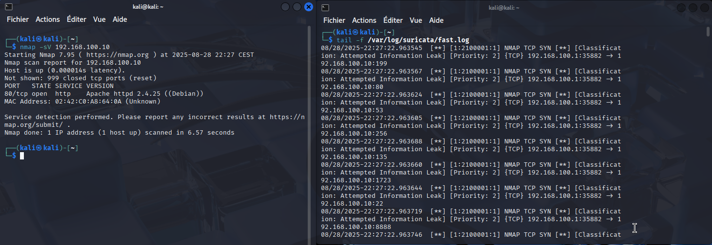
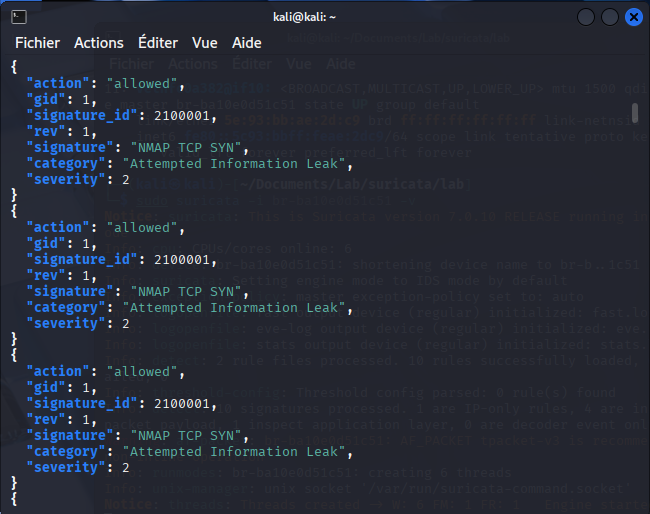

# Suricata-Splunk-SOC-Dashboard
Intégration du Suricata à Splunk pour centraliser les logs

## Introduction

## Suricata
Nous allons tout d'abord générer quelques logs avec Suricata. Pour cela, nous allons faire une reconnaissance active avec nmap que Suricata détectera.
La commande nmap : 
```bash
nmap -sV 192.168.100.10
```
et la règle Suricata :
```bash
# Détection d’un TCP SYN Scan (Nmap -sS)
alert tcp any any -> any any (msg:"NMAP TCP SYN"; flags:S; detection_filter:track by_src, count 20, seconds 10; classtype:attempted-recon; sid:2100001; rev:1;)
```

Suricata enregistre les alertes dans 2 fichiers : fast.log et eve.json.

- **fast.log** : format simple et lisible, qui consigne les alertes de manière condensée (utile pour un suivi rapide en ligne de commande).  
- **eve.json** : format JSON structuré, beaucoup plus riche en informations (timestamps, métadonnées réseau, classification, etc.), adapté pour une analyse poussée.

### fast.log

Il est possible de lire les logs avec :
```bash
tail -f /var/log/suricata/fast.log
```
Voici un exemple avec la commande nmap précédente : 



### eve.json
Et voici ce que l'on peut lire avec la commande suivante pour eve.json :

```bash
jq '.alert' /var/log/suricata/eve.json
```



## Splunk
