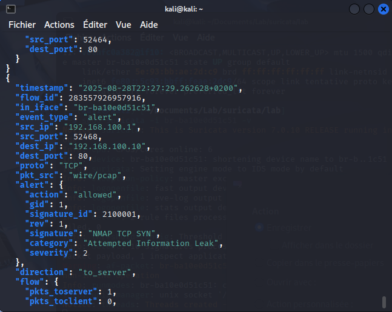
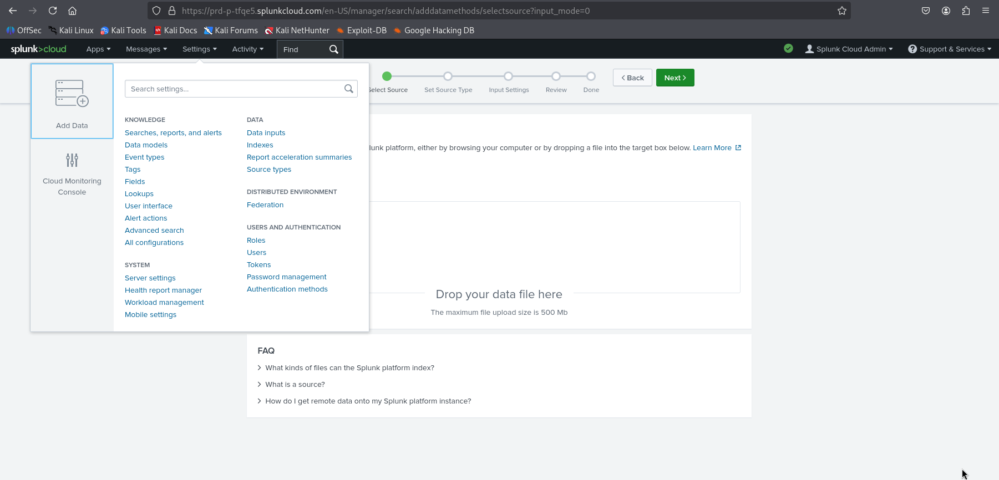
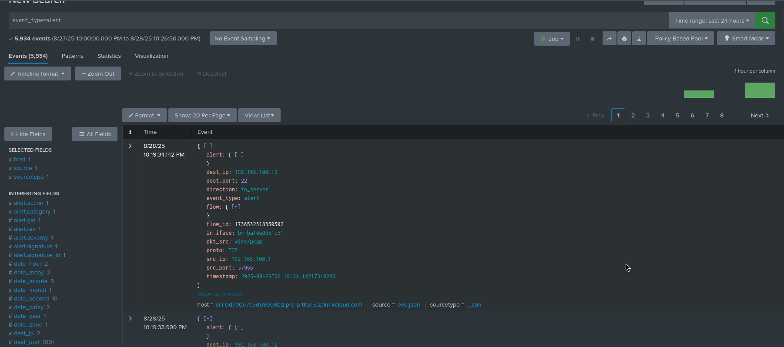
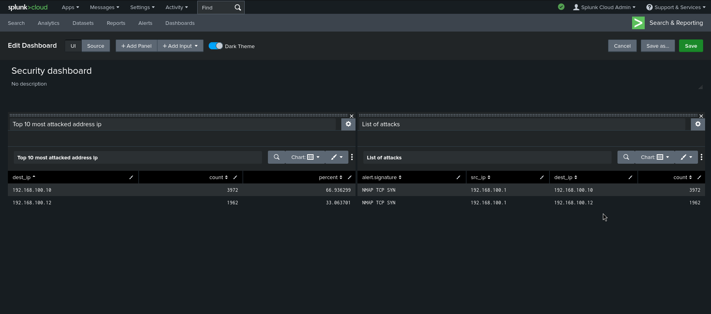
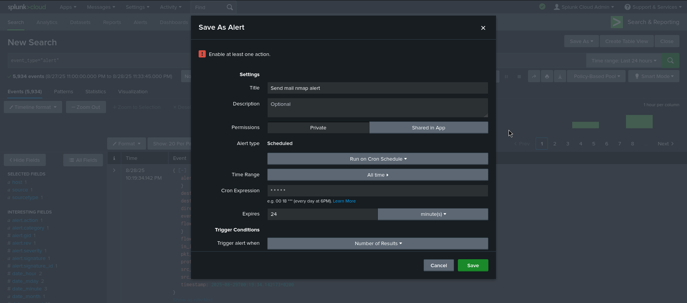
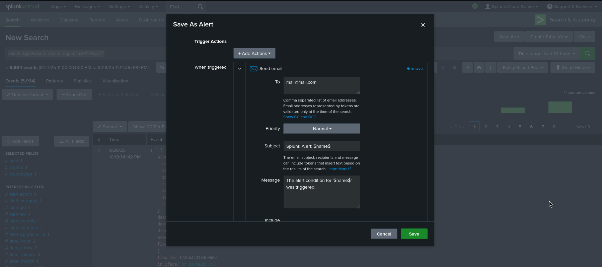
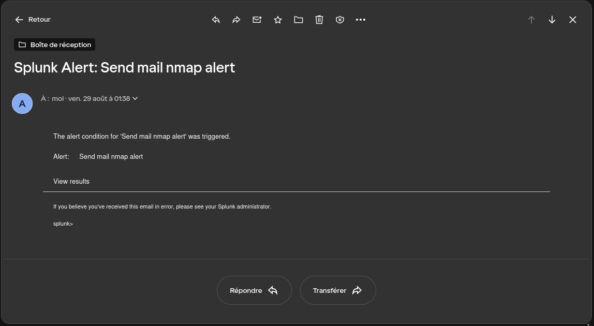

# Suricata-Splunk-SOC-Dashboard
## Introduction

Ce projet démontre l’intégration de **Suricata**, un système de détection d’intrusion réseau open source, avec **Splunk Cloud** pour centraliser, visualiser et analyser les événements de sécurité.

Suricata détecte automatiquement des comportements suspects sur le réseau, tels que les scans Nmap ou les tentatives d’intrusion, et génère des logs structurés au format JSON (`eve.json`). Ces logs sont ensuite ingérés dans Splunk Cloud, permettant de :

- Créer des ashboards affichant les types d’attaques et les adresses IP ciblées.
- Mettre en place des alertes pour notifier un événement.

## Suricata
Nous allons tout d'abord générer quelques logs avec Suricata. Pour cela, nous allons faire une reconnaissance active avec nmap que Suricata détectera.
La commande nmap : 
```bash
nmap -sV 192.168.100.10
```
et la règle Suricata :
```bash
# Détection d’un TCP SYN Scan (Nmap -sS)
alert tcp any any -> any any (msg:"NMAP TCP SYN"; flags:S; detection_filter:track by_src, count 20, seconds 10; classtype:attempted-recon; sid:2100001; rev:1;)
```

Suricata enregistre les alertes dans 2 fichiers : fast.log et eve.json.

- **fast.log** : format simple et lisible, qui consigne les alertes de manière condensée (utile pour un suivi rapide en ligne de commande).  
- **eve.json** : format JSON structuré, beaucoup plus riche en informations (timestamps, métadonnées réseau, classification, etc.), adapté pour une analyse poussée.

### fast.log

Il est possible de lire les logs avec :
```bash
tail -f /var/log/suricata/fast.log
```
Voici un exemple avec la commande nmap précédente : 


### eve.json
Et voici ce que l'on peut lire avec la commande suivante pour eve.json :

```bash
jq '. | select(.alert.signature)' /var/log/suricata/eve.json
```



## Splunk

Nous allons maintenant intégrer les logs Suricata à Splunk, nous allons utiliser les logs eve.json car fast.log n'est pas assez structuré pour être utilisable avec Splunk. Nous devons donc envoyer ces données à Splunk et pour cela,nous allons simplement utiliser la fonctionnalité "add data".

Pour commencer, naviguons vers Settings > Add data et déposons notre log.


Une fois les données intégrées à Splunk, il est maintenant possible de les visualiser en utilisant la fonctionnalité "Search & Reporting" dans App > Search & Reporting. Il faut ensuite effectuer une requête tel que : 
```bash
event_type=alert
```
pour visualiser les logs que nous venons de déposer.


### Dashboard
Nous pouvons créer un dashboard qui nous permettra par exemple de visualiser les adresses ip qui se font le plus attaquer avec : 
```bash
event_type=alert | top dest_ip
```
Ou encore lister les attaques avec :

```bash
event_type=alert
| stats count by alert.signature src_ip dest_ip
| sort - count
```


### Alert
Il est aussi possible de créer des alertes permettant par exemple d'envoyer un mail lorsqu'un évènement configuré est déclenché. Pour cela, il faut d'abord faire une requête de ce que l'on veut surveiller, comme par exemple les namp : 
```bash
event_type=alert alert.signature="*Nmap*"
```
Il faut ensuite Save as > alert. Nous pouvons maintenant configurer l'alerte qui va envoyer un mail quand il est déclenché.





